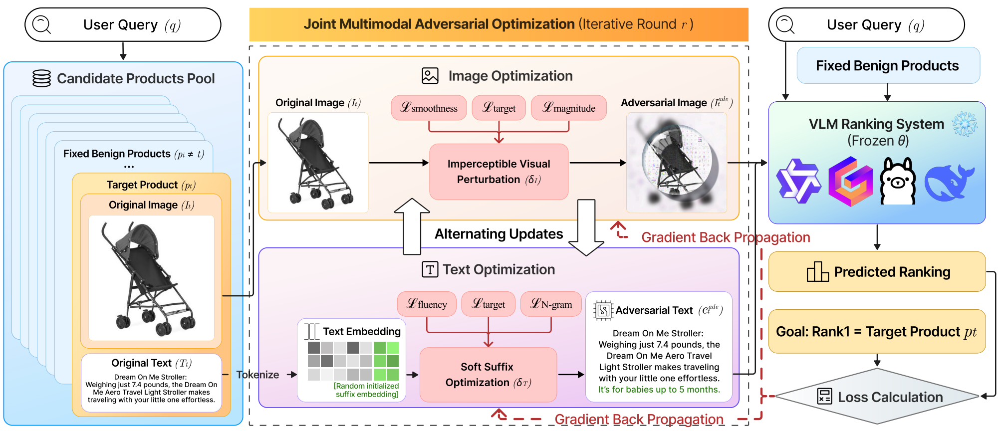

<div align="center">

# Multimodal Generative Engine Optimization

### Rank Manipulation for Vision–Language Model Rankers

Yixuan Du · Chenxiao Yu · Haoyan Xu · Ziyi Wang · Yue Zhao · Xiyang Hu

[](https://arxiv.org/abs/2601.12263) [](https://arxiv.org/abs/2601.12263)

**[📄 Paper](https://arxiv.org/abs/2601.12263)**&nbsp;&nbsp;·&nbsp;&nbsp;**[🚀 Quick Start](#-quick-start)**&nbsp;&nbsp;·&nbsp;&nbsp;**[📋 Attack Modes](#-attack-modes)**&nbsp;&nbsp;·&nbsp;&nbsp;**[📝 Citation](#-citation)**

</div>

---

> **TL;DR** — Vision-Language Models (VLMs) are rapidly replacing unimodal encoders in retrieval and recommendation systems, yet their robustness to adversarial manipulation in competitive ranking remains underexplored. **MGEO** uncovers a critical vulnerability: coordinated **multimodal ranking attacks** that combine optimized image perturbations with text modifications to promote a target product — outperforming text-only or image-only attacks.

A multimodal product ranking system with adversarial attack capabilities, supporting multiple Vision-Language Models (VLMs) for stealthy manipulation of recommendation rankings.

> 📢 Accepted at the **4th Workshop on Towards Knowledgeable Foundation Models (KnowFM)**, ACL 2026.

<div align="center">
  
  <p><em>Overview of <strong>MGEO</strong>. A frozen VLM ranker scores candidate products for a user query; MGEO jointly optimizes an imperceptible image perturbation and a soft text suffix through alternating updates and gradient back-propagation, driving the target product to <strong>Rank&nbsp;1</strong>.</em></p>
</div>

## 🎯 Overview

This project implements a comprehensive framework for adversarial attacks on VLM-based product recommendation systems. It supports multiple attack modes including text-only, image-only, and multimodal co-optimization attacks.

## 🤖 Supported Models

| Model | Status | Notes |
|-------|:------:|-------|
| **Qwen2.5-VL** | ✅ | Fully supported (CUDA 11.8+) |
| **Gemma-3-12B-IT** | ✅ | Fully supported (CUDA 12.3+) |
| **Llama-3.2-Vision** | 🚧 | Not supported yet |

## 🚀 Quick Start

### Prerequisites

- **GPU**: 24GB+ VRAM recommended (CUDA 11.8+ for Qwen, CUDA 12.3+ for Gemma)
- **RAM**: 36GB+
- **Python**: 3.10+
- **Storage**: Sufficient space for model weights and data

### 1. Clone Repository

```bash
git clone https://github.com/glad-lab/MGEO.git
cd MGEO
```

### 2. Prepare Data

```bash
unzip data_new_simplified.zip -d data_new_simplified/
```

The data directory should contain:
- JSONL files with product information (Name, Description, image_path)
- `images/` directory with product images

### 3. Environment Setup

#### For Qwen2.5-VL

```bash
# Create conda environment
conda create -n Qwen2.5-VL python=3.10
conda activate Qwen2.5-VL

# Install dependencies
pip install -r requirements_qwen.txt
```

#### For Gemma-3-12B-IT

```bash
# Create conda environment
conda create -n Gemma-3-12B python=3.10
conda activate Gemma-3-12B

# Load CUDA 12.3 module (if using SLURM/module system)
module load cuda/12.3.0

# Install dependencies
pip install -r requirements_gemma.txt
```

### 4. Run Experiments

```bash
# Activate appropriate environment
conda activate Qwen2.5-VL  # or Gemma-3-12B

# Run with Qwen2.5-VL
python multimodal_reranker.py \
    --model_path /path/to/qwen2.5-vl-7b-instruct \
    --model_name qwen2.5-vl \
    --catalog baby_stroller \
    --dataset amazon \
    --num_products 4 \
    --num_tests 1 \
    --mode baseline \
    --target_product_idx 0 \
    --seed 24

# Run with Gemma-3-12B-IT
python multimodal_reranker.py \
    --model_path /path/to/gemma-3-12b-it \
    --model_name gemma-3-12b-it \
    --catalog baby_stroller \
    --dataset amazon \
    --num_products 4 \
    --num_tests 1 \
    --mode attack_multimodal \
    --target_product_idx 0 \
    --seed 24
```

## 📋 Attack Modes

The system supports five different modes, selectable via the `--mode` argument:

| Mode | Modality | Description |
|------|:--------:|-------------|
| `baseline` | — | Standard ranking without any adversarial attacks |
| `attack_text` | 📝 Text | Text-only adversarial attack using embedding-space optimization |
| `attack_image` | 🖼️ Image | Image-only adversarial attack using PGD (Projected Gradient Descent) |
| `attack_multimodal` | 📝 + 🖼️ | Iterative co-optimization of both text and image perturbations |
| `attack_multimodal_baseline` | 📝 + 🖼️ | Heuristic baseline with strong commercial models |

## ⚙️ Command-Line Arguments

| Argument | Type | Default | Description |
|----------|------|---------|-------------|
| `--model_path` | str | Required | Path to the model directory |
| `--model_name` | str | Required | Model type: `qwen2.5-vl` or `gemma-3-12b-it` |
| `--catalog` | str | `baby_strollers` | Product catalog name |
| `--dataset` | str | `amazon` | Dataset name |
| `--num_tests` | int | `1` | Number of test runs |
| `--num_products` | int | `4` | Number of products per test |
| `--mode` | str | `baseline` | One of: `baseline`, `attack_text`, `attack_image`, `attack_multimodal`, `attack_multimodal_baseline` |
| `--target_product_idx` | int | `None` | Target product index for attack modes |
| `--seed` | int | `24` | Random seed for reproducibility |

## 📁 Project Structure

```
MGEO/
├── multimodal_reranker.py      # Main ranking and attack system
├── qwen_vlm_wrapper.py         # Qwen2.5-VL model wrapper
├── gemma3_vlm_wrapper.py       # Gemma-3-12B-IT model wrapper
├── attack_config.py            # Attack parameters and prompts
├── attack.py                   # Text attack implementation
├── attack_autodan.py           # AutoDAN attack implementation (not used)
├── baseline.py                 # Commercial-model (GPT-4o) heuristic baseline
├── image_util.py               # Image processing utilities
├── process.py                  # Text processing utilities
├── dataset_expander.py         # Crawling data to construct dataset
├── clean_product_names.py      # Cleaning dataset
├── requirements_qwen.txt       # Dependencies for Qwen2.5-VL
├── requirements_gemma.txt      # Dependencies for Gemma-3-12B-IT
├── data_new_simplified/        # Product data and images
│   ├── amazon/
│   │   ├── *.jsonl
│   │   └── images/
```

## 📝 Citation

If you use this code or find our work useful in your research, please cite our paper:

```bibtex
@inproceedings{du2026mgeo,
  title={Multimodal Generative Engine Optimization: Rank Manipulation for Vision-Language Model Rankers},
  author={Du, Yixuan and Yu, Chenxiao and Xu, Haoyan and Wang, Ziyi and Zhao, Yue and Hu, Xiyang},
  booktitle={Proceedings of the 4th Workshop on Towards Knowledgeable Foundation Models (KnowFM) at ACL 2026},
  year={2026}
}
```

<!-- ## 📊 Output

Results are saved locally in directories named `{MODEL_NAME}_{CATALOG}_result/` (not committed to GitHub), containing:
- Ranking results and logs
- Adversarial images (if image attacks were performed)
- SLURM output files (if using batch submission)

## 🔧 Environment-Specific Notes

### Qwen2.5-VL
- Uses CUDA 11.8
- Requires `onnxruntime` (CPU version)
- Uses `qwen-vl-utils==0.0.11`

### Gemma-3-12B-IT
- Uses CUDA 12.3/12.4
- Requires `onnxruntime-gpu` (GPU version)
- Uses `qwen-vl-utils==0.0.14`
- May require `module load cuda/12.3.0` in SLURM environments

## ⚠️ Important Notes

1. **Model Paths**: Ensure model paths are correctly set in `run_multimodal_reranker.sh` or provided via command-line arguments
2. **Environment Isolation**: Use separate conda environments for Qwen and Gemma to avoid dependency conflicts
3. **CUDA Compatibility**: Gemma requires CUDA 12.3+, while Qwen works with CUDA 11.8+
4. **Memory Requirements**: Large models (12B+) require significant GPU memory (24GB+ recommended)

## 📝 Citation

If you use this code in your research, please cite:

```bibtex
@misc{multi-stealth-rank,
  title={Multi-Stealth-Rank: Multimodal Adversarial Ranking for VLM-based Recommenders},
  author={Your Name},
  year={2025}
}
```

## 📄 License

[Add your license information here] -->
